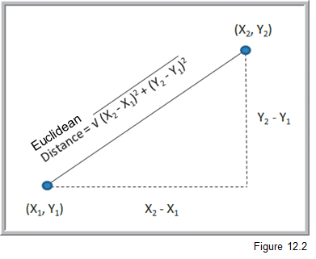

**************************************************************************
Intro to statistical predictive modeling - go beyond this class (OPTIONAL)
**************************************************************************

The massive increases in both the amount of available electronic data as well in cheap computing power has contributed to an area that has been termed "data mining" or "knowledge discovery in databases" or "data science" or "big data". Of course, along with much true value there is always some hype (some statistics folks derisively refer to data mining as "data dredging" or "fishing expeditions"). As always with quant methods, there are pros, cons, and underlying assumptions of any technique. What is particularly interesting about data science is that it has brought together people from multiple fields - statistics, information systems, computer scientists, operations researchers, management scientists. Anytime we get academics/researchers/wizards out of their individual ivory towers and talking to their peers in a shared courtyard, good stuff happens.

In a nutshell, data science is the use of a wide range of techniques that borrow, to differing extents, their ideas from the worlds of probability, statistics, pattern recognition, computer science, databases, and large scale computing to unearth useful information from giant quantities of data. There are different types of data mining problems such as reduction, classification, association and prediction and different techniques are used in different ways depending on the problem. Some of these techniques, like multiple regressions, are old classical statistical techniques while others like neural networks are more recent innovations from the world of artificial intelligence. The data we mine tends to be "big" both in terms of number of rows, but perhaps more importantly, in the number of columns (variables). Teasing out meaningful, relationships among these many variables, related in complex ways, is a goal of data mining. While we are often used to working with nicely structured tables of numeric and categorical data, data mining dares to venture into the messy world of text analytics (e.g. Twitter feeds) and other unstructured data. I've had a bit of experience with this in dealing with a myriad of free text fields in hospital databases (e.g. "Reason for visit to ER", and unbelievably, "Expected due date" for an OB patient).

Objectives
====================

So, in this module I hope to:

* Introduce you to the general topic of data science and some of the shared concepts that underlie the field
* Introduce and show examples of the main families of data science problems
* Give you an opportunity to try out some of these techniques

  - we can actually use Excel to explore simple versions of some of these techniques
  - JMP implements many statistical predictive modeling techniques.
  - The Palisade Decision Tools Suite (of which @Risk is a part) contains a few "data mining" algorithms. Logistic regression and discriminant analysis are included in StatTools and neural networks are in NeuralTools.
  - In addition, Ch 17-3 of our textbook shows how you can use a free add-in from MS called the Microsoft Data Mining Add-In for Excel. Unfortunately this requires a connection to a SQL Server Analysis Server database.
  - Some of the videos use XLMiner. You can get a 15 day free trial version of it at http://www.solver.com/xlminer-data-mining. 
  - lots of free and open source software out there for data science (the R and Python communities are especially active in this area)
        
* Whet your appetite for this fascinating field
  - Data science has become a "sport" - check out http://www.kaggle.com/. Kaggle has become much more than a predictive modeling competiton site. It's now a great center of learning for those interested in predictive modeling and machine learning, as well as a source of many interesting datasets.
  - Read "The Signal and the Noise" by Nate Silver.

We certainly will not have time to cover all of the stuff below during class time. However, you can revisit the stuff we don't get to after the term. If you want to learn more about this topic, consider taking MIS 4560/5560 - Intro to Data Science or my `MIS 4470/5470 - Practical Computing for Data Analytics <http://www.sba.oakland.edu/faculty/isken/courses/mis5470/>`_ (uses Linux, R, and Python) course. In the 4560/5560 course, you'll use JMP or SAS and tools like RapidMiner which implements many commonly used data mining techniques. 

Readings
========

* Business Analytics - Chapter 10-11: Regression Analysis

Yep, good ol' regression is one of the workhorses of data mining.

* Business Analytics - Chapter 17: Data Mining

This chapter provides a great introduction to the main data mining techniques that are used for reduction, classification, prediction and association (the major families of data mining problems).

Downloads
=========

* `Downloads_Data Science.zip <https://drive.google.com/file/d/1pd5jPdA17vb0Y0O1bcU5BZLqkV4vSDEA/view?usp=sharing>`_

If interested, here is the courseweb page for the first night of class in MIS 4470/5470 - Practical Computing for Data Analytics. You'll find screencasts that cover everything we do that first class and get a really good feel for a totally different way of doing analytics work.

* `Intro to Practical Computing for Data Analytics (MIS 4470/5470) <http://www.sba.oakland.edu/faculty/isken/courses/mis5470/kickoff.html>`_

Activities
===================================

You can find a set of PPT slides in the downloads file.

Classes of data science modeling techniques
-------------------------------------------

There are several families of problems and many, many algorithms that might be considered part of the domain of data science. But let's start by just considering a few general families of data science problems. Different people might define some of these slightly differently, but I'll try to stick to the textbook's families but add my own comments and caveats.

The four families of common data mining problems are:

* Data exploration and reduction - reduce a bunch of data down into interesting and useful groups

 - Example: Market segmentation models
 
* Classification - predict what class a newly observed data point will fall into

 - Example: Is this credit card transaction fraudulent?
 
* Association - which things are associated with which other things

 - Example: The apocryphal story of beer and diapers relationship
 
* Cause and effect-modeling - model relationships between dependent and independent variable

 - Example: The Pythagorean Theorem of baseball
 
Unsupervised learning - Cluster analysis
----------------------------------------

We have a lot of data and we want to reduce it down to a more manageable representation. A histogram is a type of data reduction. Often reduction boils down to putting similar things together into buckets (similar values end up in same bin in a histogram). Market segmentation models are a good example. Often, the number and "name" of the buckets isn't really even known. Part of the mining process is to discover interesting buckets. One of the most well known techniques for this is called cluster analysis. It's a multivariate statistical technique that's been around for quite some time. We want to take individual data points and put them into clusters such that things within a single cluster are similar, but the clusters themselves are distinct from each other. Clustering pops in numerous fields such as biology (taxanomies of living creatures), medicine (disease variant identification), information retrieval (clusters of similar web pages), pattern recognition (classifying objects in photos) and business (market segmentation being the classic use case).

So, clustering is a type of "classification" of things based on data about those things. In the data mining world, clustering is referred to as "unsupervised classification" where the unsupervised part refers to the fact that we do NOT have predefined classes that we are trying to put new items into. Supervised classification would be, for example, when we have a bunch of customer load data, including whether the customer defaulted or not on the loan, and we build a classifier model using this data to predict whether a new customer will default or not. We'll talk about that later. For clustering, we don't have predefined classes.

One of the most well known methods for doing clustering is called K-means cluster analysis. We want to create clusters whose centroids are far away from each other but who has members that are close to their own centroid. K is the number of clusters and you have to specify it in advance. Wait, how do we know what K should be? We don't. So, usually we try different values of K and then try to make sense of the solution - e.g. can we put a meaningful name on each cluster after we've seen their collection of data points. The other widely used approach is called hierarchical clustering. We either iteratively "fuse" data together into clusters (called agglomerative clustering) or iteratively break apart the whole data set into clusters (divisive clustering). Some sort of stopping rule is used to determine when we are done. You may wonder how it is we decide that two data points are "close to each other". Well, there's a whole bunch o' distance metrics that get used as well as a whole bunch of different algorithms. The simplest, for all numeric data, is simple Euclidean distance.

Often when we are clustering, we may have a number of attributes (variables) for each data point or observation. Here's what a 3-D clustering result might look like:

Doing a Google Images search on "cluster analysis" will give you a good visual sense of what clustering is doing.

There isn't one "right answer" that pops out of clustering. It's an iterative, exploratory process by which you try to find interesting and meaningful clusters that provide some sort of value to you in the sense of analysis or decision making. It can be difficult to find distinct clusters in many datasets. Underlying clustering techniques are optimization problems - we want to minimize some distance metric for observations within a cluster while maximizing the distance between different clusters. There are many different algorithms for doing this, numerous details and side issues which are beyond what we can do in this class. I just hope to give you a sense of what clustering is about and how it might be used in the context of business.

Let's look at a simple example of doing clustering using Excel and the Evolutionary Solver. We'll use the Colleges and Universities data set that we used for regression in the first part of this module. Within the Downloads you'll find a file called UniversityClusters.xlsx. Let's explore how we can find clusters of universities using basic K-means cluster analysis. We'll use 4 clusters for this example.

* `Screencast - Cluster analysis of universities <https://youtu.be/tdNvcWyHiZ0>`_

Linear regression
-----------------

Regression is still a workhorse of predictive modeling. Also, a thorough
knowledge of regression modeling really helps learn the other 
predictive modeling techniques. It serves as a great vehicle for
learning about the entire predicting modeling workflow cycle. Linear regression is covered in Ch 10-11 of Business Analytics.

So, we have already seen bivariate regression models back in Module 2 on simple mathematical models. We fit models in Excel a bunch of different ways:

* scatter plots with trend lines
* Data Analysis Toolpak
* Slope() and Intercept() functions
* The Linest() array function
* and even using Solver

We saw that we could use various error metrics like R^2 or RMSE to evaluate how well a linear model fits a given data set and how well it predicts on a new dataset.

Now we don't just have a single independent variable. We may have many independent variables. How do we fit such models? How do we assess how good they are? What happens if my independent variables are correlated with each other? Can I use categorical data? How do I use regression models for prediction?

**NOTE** The following screencasts are still at my old hosting site. I need to move them to YouTube but they should work through end of W23 semester.

* `SCREENCAST - The multiple regression model (7:55) <http://www.screencast.com/t/j56igNuo1y>`_
* `SCREENCAST - Putting the "least" in ordinary least squares (8:52) <http://www.screencast.com/t/YyufrEiuab1>`_
* `SCREENCAST - What is this R-squared you speak of? (5:01) <http://www.screencast.com/t/rLChY4F3lKYB>`_
* `SCREENCAST - Predicting college graduation rates: Intro (6:25) <http://www.screencast.com/t/TfZ7sesul>`_
* `SCREENCAST - Predicting college graduation rates: Explore and fit model (8:54) <http://www.screencast.com/t/ab4XbTh8N8Xo>`_
* `SCREENCAST - Predicting college graduation rates: Assessing model fit (12:35) <http://www.screencast.com/t/OTnesi7E9yk>`_
* `SCREENCAST - Predicting college graduation rates: Checking regression assumptions (14:30) <http://www.screencast.com/t/gku78pdTbb08>`_
* `SCREENCAST - Predicting college graduation rates: Using model for prediction (8:45) <http://www.screencast.com/t/Kzpzzvc5Zu>`_
* `SCREENCAST - Predicting Major League Baseball wins: The multicollinearity problem (15:47) <http://www.screencast.com/t/ixWHntkna>`_
* `SCREENCAST - Predicting Major League Baseball wins: Predicting with new new data (6:53) <http://www.screencast.com/t/svhlvhhJe1>`_
* `SCREENCAST - Using categorical variables in regression models (24:14) <http://www.screencast.com/t/z9Q1tfLcZre>`_
* `SCREENCAST - Modeling interactions among variables (5:39) <http://www.screencast.com/t/JlRHzotopd>`_

Classification
---------------

* `Screencast - Partitioning data with XLMiner (6:39) <http://www.screencast.com/t/XnJv5tmzYG0>`_

Classification problems are characterized by the desire to classify entities (records) into one or more predefined classes based on the values of other data attributes. For example, here's a dataset from the Credit Approval Decisions.xlsx. We want to build a classifier model to help us approve or reject loan applications based on relevant independent variables like credit score and whether or not the applicant owns a home.

.. image:: images/classification-1.png

So, the blue shaded columns are the independent variables and the green decision column is the classification that we want to predict. Before applying a classification algorithm to this dataset, we would recode the Decision column with 1=Approve and 0=Reject. We'd also have to recode the Homeowner field in a similar way (e.g. 1=Y, 0=N).

A simple classifier might be to simply approve everyone with a credit score above a certain value such as 640. A slightly more sophisticated classifier might consider both credit score and years of credit history. So, now we can visualize the approve/reject decisions in two dimension.
credit scatter 1

Now, instead of the simple classifier that only looks at credit score we could try to find a line that slices the data in way that captures classifies the records more accurately by using both credit score and years of credit history. One possible alternative model is:

Notice that this model actually has a higher misclassification rate but that they are different types of errors than the model above. More on misclassification below.

This is the training dataset. We will train (build) a model on this data in which we have known class values (the Decision). Then we can use the model on a validation dataset that looks something like this:

Ideally, we have another set of data to test whatever model "wins" the competition based on the validation dataset.

XLMiner has facilities for partitioning datasets into training and validation sets. See Example 12.4 on p379 for the details. There's a short screencast below showing data partitioning in action:

There are various performance metrics for evaluating and comparing classification algorithms. One essential measure is something called the classfication confusion matrix. It's just a simple table summarizing the correct and incorrect classification predictions. For the example above, it would look like:

There are numerous classification approaches and algorithms, each with numerous variants or problem specific customizations. In this introduction, we'll take a look at a few widely used techniques - descriminant analysis and logistic regression.

Classification - Descriminant analysis
--------------------------------------

Like k-NN, discriminant analysis, or LDA for "linear discriminant analysis" is used to classify new observations into a set of predefined classes. However, it works by creating "discriminant functions".
The basic steps to determine the class of an observation:
1. Create linear discriminant functions of the form:

$$ L = b_{1}X_1 + b_{2}X_2 + ... + b_{n}X_n + c$$

where :math:`b_i` are the discriminant coefficients (weights) and are determined by maximizing between-group variance relative to within-group variance

2. One discriminant function is formed for each category.

3. New observations are assigned to the class whose function L has the highest value.

Notice that the discriminant functions are nothing more than simple linear functions of the input variables that are attempting to separate distinct classes of observations.

LDA does assume that are independent variables are normally distributed though it seems to be pretty robust to violations of this assumption. There is quite a bit of statistical theory behind LDA and it has been around for a very long time (like many of the so called "data mining" techniques) - I learned about it in grad school in the 80's and it was already old then. Get yourself a good multi-variate statistics book if you really want to learn about the underlying statistical theory. A classic, and still leading, text is `Applied Multivariate Statistical Analysis <https://www.amazon.com/Applied-Multivariate-Statistical-Analysis-6th/dp/0131877151/ref=sr_1_1?ie=UTF8&qid=1529293024&sr=8-1&keywords=Applied-Multivariate-Statistical-Analysis>`_ by Johnson and Wichern.

Here is a short screencast on doing LDA with Excel and Solver.

* `Screencast - Using LDA to classify Wall Street Journal subscribers <https://youtu.be/jagfBeb99-A>`_

Classification - Logistic regression
--------------------------------------

Logistic regression (LR) is a variant of ordinary linear regression. When we looked at linear regression earlier, recall that the dependent variable was continuous. In LR, the dependent variable is categorical - usually binary. So we use LR when we want to predict a variable with a 0 or 1 outcome. What's nice is that we can interpret the output of an LR model as the Prob[Y=1]. So, we actually get a continuous output that we can interpret in a familiar way - it's just a probability. So, instead of just classifying a credit approval application as Approve or Reject, we can interpret output as the probability of the customer being a good credit risk.

Once we use our LR model to predict p=Prob(Y=1), we can use a "cutoff value", usually 0.5, to then classify the new record as a 1 or a 0.

So, let's revisit our credit approval problem one last time and use LR as our classifier. LR is covered in Section 17-4a in our textbook.

* `Screencast - Using LR in our credit approval problem (5:40) <http://www.screencast.com/t/EDfV7bMh61s>`_

