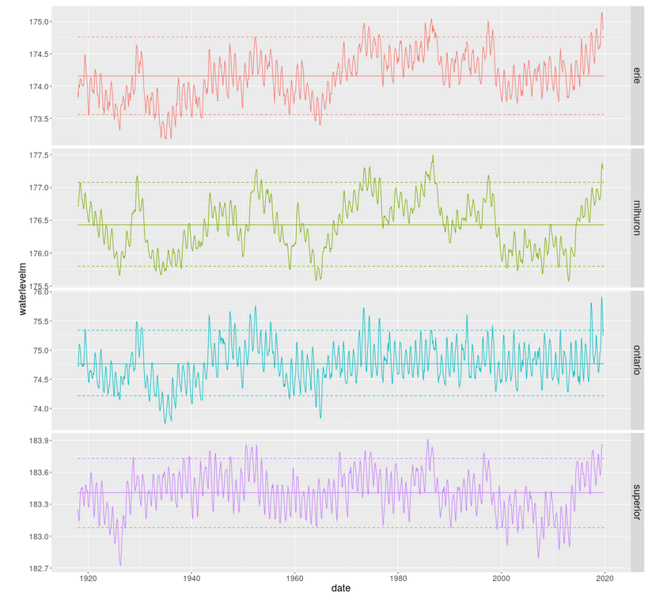

***********************************
Intro to data visualization
***********************************

Readings
========

* Business Analytics: Chapter 2 - Describing the Distribution of a Single Variable
* Business Analytics: Chapter 3 - Finding Relationships Among Variables

Both Ch 2 and 3 are chock full of good stuff for using Excel to start exploring data. Hopefully some of it is review for you but I'm sure there is much new stuff for most of you. 

The following compressed folder contains a few pdfs discussing principles of graphical excellence and development of effective business dashboards. I've also included it in the Downloads-DataViz.zip file.

* `Principles_data viz.zip <https://drive.google.com/file/d/1Bnn0BUT6C72a65LVv7nRR9MUntsf08_2/view?usp=sharing>`_

Downloads
=========

* `Downloads-DataViz.zip <https://drive.google.com/file/d/1SJDnj6g7PoDDXxsLWpuTrYtMBHCeD_cj/view?usp=sharing>`_

Screencasts and other activities
================================

Start with a general introduction to data visualization principles.

* `SCREENCAST: Data Viz Intro  <https://youtu.be/mULfakerQnY>`_ (15:45)

NOTE

Now we'll go into more detail by using Excel specific examples.

First some general table and graph principles.

* `SCREENCAST: Tables and Graphs <https://youtu.be/Rt2H1vyKvFQ>`_ (8:56)

A tour of the Conditional Formatting features in Excel (including creating formula based formats).

* `SCREENCAST: Conditional Formatting <https://youtu.be/0hZ8te1_LoI>`_ (11:24)

Summary statistics and plots such as histograms and box plots are one of the ways that we visualize the distribution of a dataset. In these next few screencasts, we'll use the DAT along with Excel formulas for doing descriptive statistics. In addition, I'll show how using range names or Excel Tables can facilitate efficient formula creation. Then I'll show you three different ways to create histograms (and we are going to see a few more as well in later parts of the course) - using the Data Analysis ToolPak, using the FREQUENCY() array function, and using the newish Excel histogram chart type. Histograms can also be created using Pivot Tables and Charts and I'll show that in the upcoming session on multidimensional data modeling and analysis. In the screencast on histograms, I'll also demo the newish box & whisker plots.

* `SCREENCAST: Descriptive statistics in Excel <https://youtu.be/LkcdiOEj1G0>`_ (12:05)
* `SCREENCAST: Histograms 3-ways <https://youtu.be/CMxvKSlQq2E>`_ (18:43)

Now, see some advanced chart techniques.

* `SCREENCAST: Dynamic Charts <https://youtu.be/l6OWLUFe-YU>`_ (9:30)

* `SCREENCAST: In-cell graphs and Sparklines <https://youtu.be/9_9hxO_4C8w>`_ (6:43)

* `SCREENCAST: Using dynamic ranges to drive graphs <https://youtu.be/m9KfpI5vy0Y>`_ (11:08)

The final few slides introduce motion charts, small multiples and some future possibilities. Check out the links on those slides. In particular, the notion of small multiples has become quite important in the field of data visualization. We'll see that these are quite easy to create with tools like Tableau, but are much more tedious to do in Excel. Creating small multiples with programmatic tools like R or Python is also quite easy. Here's an example from a `blog post I did on Great Lakes water level analysis <https://bitsofanalytics.org/posts/great-lakes-water-levels/get_plot_gl_water_levels.html>`_ with R.

Explore (OPTIONAL)
==================

* `xkcd on graphs <https://xkcd.com/1945/>`_ and `on linear regression <https://xkcd.com/1725/>`_
* `Towards a Theory of Bullshit Visualization <https://research.tableau.com/sites/default/files/altvis-bullshit.pdf>`_ - a wickedly good read

* A few Bret Victor creations:

    - `Drawing dynamic data visualizations <http://worrydream.com/#!/DrawingDynamicVisualizationsTalk>`_
    - `Designing an infographic <http://worrydream.com/#!/HowManyHouseholds>`_

* What do analysts actually do day to day? `Enterprise Data Analysis and Visualization: An Interview Study <http://web.cse.ohio-state.edu/~machiraju.1/teaching/CSE5544/Visweek2012/vast/papers/kandel.pdf>`_

* `FlowingData <https://flowingdata.com/>`_

* `The classic TED talk by Hans Rosling <https://www.youtube.com/watch?v=RUwS1uAdUcI>`_ - the world meets animated bubble charts

