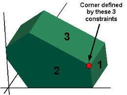

***********************************
Optimization modeling
***********************************

This is an introduction to optimization using Excel Solver. We'll see examples of linear, non-linear and integer optimization problems. These beasts pop up in all kinds of business problems. They are fun to do because we get to make Excel and Solver do the hard work of coming up with the answers (once we formulate a good model).

I hope to give you a glimpse into the amazing breadth and power of optimization modeling and solver tools available to business analysts. Optimization models are lurking under the hood of many common business applications. In fact, while data mining and "predictive analytics" is all the rage, when you look into the details you find statistics, simulation, and optimization. 

If you want to learn more about optimization modeling, consider taking QMM 4400 (Management Science) in the SBA within the friendly confines of Excel.
If you want to learn more about the math of optimization, there are a number of courses offered in the Math/Stat department such as MOR 3330 (Engineering Operations Research), MOR 4554 (Linear and Integer Optimization) and MOR 4555 (Nonlinear Optimization).

If you want to see a real example of the power of optimization in one of Michigan's
largest companies, here's a video describing General Motors `Vehicle Content Optimization <https://www.youtube.com/watch?v=R2MBYlFx_LQ>`_ tool. GMs work was honored by being named a finalist in the prestigious Edelman Award
in 2022 for high impact analytics work.

Objectives
====================

We are starting in on optimization modeling this week. The focus in our class will be on learning how to model certain kinds of problems as optimization problems, translate them to Excel, and solve them using Solver. Due to time constraints, we will not go deeply at all into the underlying mathematical theories related to optimization (though they are fascinating and well worth some study) but I will try to convey the basic ideas behind the three main algorithms in the Excel Solver:

* The Simplex Method for linear programs
* The GRG Nonlinear method for non-linear problems
* The Evolutionary algorithm for general optimization problems
    
Readings
========

From our Business Analytics text:

* Ch13 - this is the main intro to the general topic of optimization
* Section 14.8 - basic ideas behind nonlinear models
* Section 14.7 - basic ideas behind integer opt models
* Sections 14.1-14.3 and 14.5-14.6 - examples of linear programming problems
* Section 14.4 - examples of problems that can be modeled as networks

Downloads
=========

* `Downloads_Opimization.zip <https://drive.google.com/file/d/1y2YMVP5_qhr8YtqyDismFuk-ROjRZOAp/view?usp=sharing>`_

You can find the SolverTable add-in at `Chris Albright's Free Downloads <https://kelley.iu.edu/albright/free_downloads.htm>`_ page.

Screencasts and other activities
================================

Intro to Optimization
------------------------------

To start, let's talk a little about optimization...

* `SCREENCAST: Intro to optimization <https://youtu.be/n3LetCSL8OY>`_ (16:25)

Now, let's revisit the Golf Clubs Pricing problem from the perspective of non-linear optimization...

* `SCREENCAST: Golf clubs pricing via optimization <http://www.screencast.com/t/ToyIi9cZdHF>`_ (23;07)

Time to tell you scary Solver stories...

* `SCREENCAST: The nasty function <http://www.screencast.com/t/KjjDwPDTEM>`_ (17:42)

Ok, let's start to learn to build Excel optimization models... (the sound quality isn't the greatest in the next screencast). This problem is Example 13.1 in the
BA textbook (the screencast is based on a different version of the text that I used to use). The problem hasn't changed. Also, see the PPT slides available in Moodle for lots of details.

* `SCREENCAST: A product mix optimization problem <http://www.screencast.com/t/zrejUXEj>`_ (34:35)

We can use the free SolverTable add-in created by Chris Albright to do some
sensitivity analysis on our Product Mix problem.

* `SCREENCAST: Installing and using SolverTable to do sensitivity analysis <https://youtu.be/LRxAho_mxR4>`_ (8:41)

Now, I want you to try to build a model of your own. In the PPT slides you'll find one about the "IRS Supercomputer" problem. The problem is `number 88 in this pdf <https://drive.google.com/file/d/1MY4vdPUS5_KuRJUutTgIEGm1WNlMqIuH/view?usp=sharing>`_ (which is also available in the Downloads file). Try this problem. Here's the screencast that walks you through it.

* `SCREENCAST: IRS Supercomputer Problem <https://youtu.be/Vr5JbhRObxg>`_ (34:22)

Problems with integer variables
--------------------------------

As discussed in the slides and in the textbook, constraining some decision variables
to only take on integer (or binary) values:

* is extremely common when modeling real business problems
* can make the problems MUCH more difficult to solve,
* but, Solver includes several algorithms that can often optimally solve (or at least find really good solutions)

An automated shift scheduling model
^^^^^^^^^^^^^^^^^^^^^^^^^^^^^^^^^^^^^

For our first example with integer variables, let's take a look at a shift scheduling model that I've embedded in a VBA driven decision support tool. 
We'll see how a little VBA can make your models easy to use. The decision
variables are the number of employees assigned to various shifts and we
want the solution to use only integer numbers of employees.

* `SCREENCAST: Shift Scheduling Model Based Decision Support Tool <http://www.screencast.com/t/zYXbc4hfElYY>`_ (20:38)

An investment modeling challenge
^^^^^^^^^^^^^^^^^^^^^^^^^^^^^^^^

This is a nice little challenge showing the power of binary variables for optimization modeling. Binary variables can only take on the values 0 or 1,
and thus get used in problems in which some type of yes/no decision is
being modeled. In this example, we'll use binary variables to represent 
a set of investment decisions where for each investment we are allowed to
either invest (1) or not invest (0). You'll see that I challenge you to
add various constraints to model certain business logic - pause the video
and try it yourself before seeing the answer.

* `SCREENCAST: Investment modeling challenge <https://www.screencast.com/t/HJnLGlsK4>`_ (29:57)

An airline hub location model
^^^^^^^^^^^^^^^^^^^^^^^^^^^^^^^^

Another use of binary variables is in facility location problems. This
next example is based on Example 14.10 in our BA textbook.

* `SCREENCAST: Airline hub location problem <https://youtu.be/u5NoGcYfSS4>`_ (20:30)

What if your model is too big for free version of Solver?
^^^^^^^^^^^^^^^^^^^^^^^^^^^^^^^^^^^^^^^^^^^^^^^^^^^^^^^^^^

There are many good free and open source optimization solvers out there. A research group in New Zealand has taken it upon themselves to create an Excel add-in called `OpenSolver <https://opensolver.org/>`_ that can use one of these free solvers or other high quality commericial solvers that a company may own. It's easy to install and use and includes the high quality `cbc solver <https://github.com/coin-or/Cbc>`_ with it. If you are using optimization in your project, you might want to check it out OpenSolver.

A peek under the hood (OPTIONAL)
--------------------------------

Let's see a little on how these optimization algorithms work.

This is what the feasible region to a linear program (in 3 variables) looks like. It's called a polyhedron.

The optimal solution will lie either at a corner or on a segment connecting two corners (in which case all the points on that segment are optimal).

The Overview of LP screencast talks about some of the key properties that make an optimization problem linear (and easy to solve). It's based on a few of the slides as well as some web based `Java applets for visualizing how the simplex method (used by Solver) works <http://optlab-server.sce.carleton.ca/POAnimations2007/Default.html>`_ to find the optimal solution to an LP.

* `SCREENCAST: How does linear programming work? <http://www.screencast.com/t/2KwvSjQ3CsP>`_ (17:15)

The Graphical Solution screencast shows how you can confirm that Solver's solution is optimal by graphing the feasible region and a few isoprofit lines. Creating the graphs is a little tricky and that's why I created this video.

* `SCREENCAST: Graphical solution of 2D LP <http://www.screencast.com/t/eCKQ8x1f>`_ (23:48)

Let's learn a little history behind linear programming and how we got to today's modern and unbelievably powerful solvers. I'll show you an open source solver called GLPK and an algebraic modeling language called AMPL (with open source clone GMPL) so that you can see how optimization problems are formulated and solved outside the realm of spreadsheets.

* `SCREENCAST: Before and Beyond Solver <http://www.screencast.com/t/TGP69gAVWmGJ>`_ (29:41)

Explore (OPTIONAL)
==================

* `Spreadsheet Model Helps to Assign Medical Residents <https://pubsonline.informs.org/doi/abs/10.1287/inte.1070.0337>`_
* `Slime molds can design railway networks?! <http://www.wired.com/2010/01/slime-mold-grows-network-just-like-tokyo-rail-system/>`_

More traveling salesperson wizardry from R Studio and xkcd
----------------------------------------------------------

* `R Shiny based traveling salesperson app <https://gallery.shinyapps.io/shiny-salesman/>`_

* `xkcd on the Traveling Salesman problem <https://xkcd.com/399/>`_

xkcd is the ultimate nerd comic. It's so nerdy that the xkcd community created `this site to explain each xkcd comic is painstaking detail <http://www.explainxkcd.com/wiki/index.php/399:_Travelling_Salesman_Problem>`_. There is much to be learned from this site.

* `xkcd on spreadsheets <https://xkcd.com/1906/>`_
* ... and then in very next installment, `xkcd on optimization! <https://xkcd.com/1908/>`_
