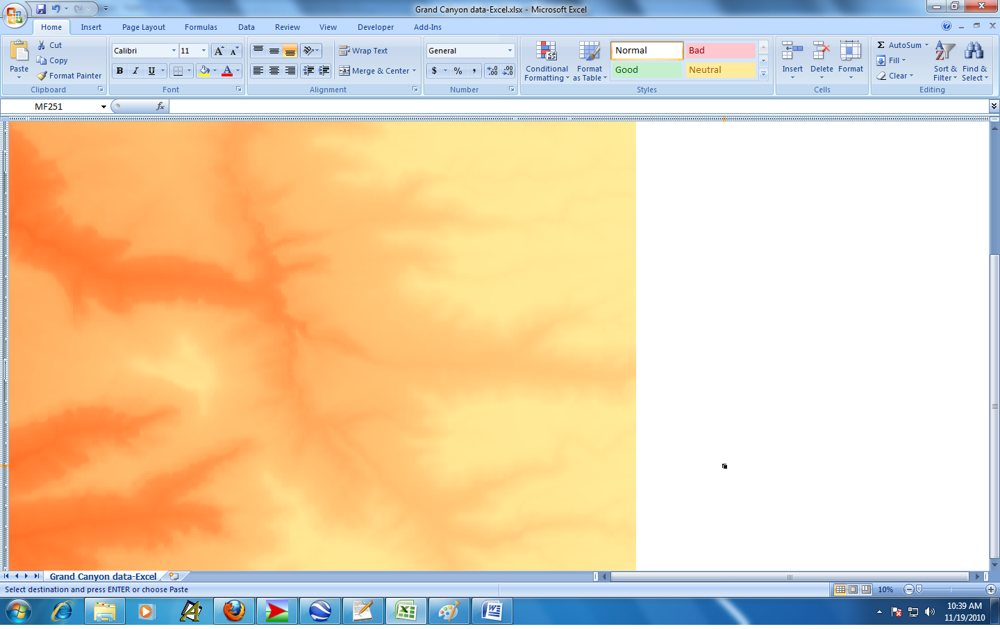

***********************************
Simulation modeling
***********************************

Monte-Carlo simulation is a powerful way of modeling uncertainty in spreadsheet models. Excel add-ins such as @Risk make it pretty easy to build and analyze spreadsheet simulation models. Of course, we need to make sure we understand how to apply probability and statistics to the construction, running and analysis of these models.

Objectives
====================

 After this Module you should:

* Be able to construct basic spreadsheet simulation models,
* Understand and be able to use probability and statistics to both build simulation models and properly analyze the results,
* Understand the "Flaw of Averages" and its implications for building spreadsheet models,
* Be able to use @Risk and other specialized Excel add-ins to build and analyze simulation models.
    
Readings
========

* Business Analytics - Chapter 15: Introduction to Simulation Modeling
* Business Analytics - Chapter 16: Simulation Models

Chapter 15 does a nice job of introducing numerous aspects of spreadsheet simulation including modeling building, understanding the Flaw of Averages, input modeling, output analysis and using Excel and @Risk to do simulation modeling. Chapter 16 has lots of examples.

Downloads
=========

* `Downloads_Simulation.zip <https://drive.google.com/file/d/1LkqAwP6ipODsHQrd8wv_CUuhmglfgtJB/view?usp=sharing>`_

Screencasts and other activities
================================

Intro to Simulation with Excel
------------------------------

In Example 15.1 - Ordering Calendars at Walton Bookstore. Before getting to use @Risk, we'll learn to build simulation models with Excel only. This will help us understand (and really appreciate) what add-ins like @Risk are doing.

* `SCREENCAST: Building an Excel Based Simulation Model <https://youtu.be/2nDTwZ1bYPI>`_ (38:37)
* `SCREENCAST: Using Data Tables for Excel Based Simulation <https://youtu.be/q62I_AVRMn8>`_ (12:50)

Intro to Simulation with Excel and @Risk
----------------------------------------

Now, let's revisit the Walton Bookstore problem using @Risk.

* `SCREENCAST:Using @Risk for Spreadsheet Simulation <https://youtu.be/qoE7ofmIbSQ>`_ (16:50)

* `SCREENCAST:Understanding and Using @Risk Outputs <https://youtu.be/sZJ9WKVEHjU>`_ (11:53)

* `SCREENCAST: Using RiskSimTable to Analyze Multiple Scenarios <https://youtu.be/gLxvqzX35lI>`_ (8:45)

How do you go about figuring out what input distributions to use?

* `SCREENCAST: Distribution fitting with @Risk <https://youtu.be/Q_eNicNLq7A>`_ (35:46)

Hey, is there some way that we can combine the "what if?" power of simulation with the "what's best?" power of Solver? Yep, check out RiskOptimizer.

* `SCREENCAST: Using RiskOptimizer to Optimize and Simulate <https://youtu.be/QBEI8u5MEnk>`_ (13:44)

What if my random input variables are correlated? (OPTIONAL)

* `SCREENCAST: Modeling correlated inputs - a stock example <https://youtu.be/hatjoiKDMyY>`_ (12:42)

Explore (OPTIONAL)
==================

Review of state of business analytics by Deloitte and Touche
------------------------------------------------------------

Insightful review of the challenges faced by analytics for organizational change.

`A Delicate Balance <https://drive.google.com/file/d/1bWco4SdpQ34dSunPDyWdyon3KNXUD1-o/view?usp=sharing>`_

Digital elevation map of the Grand Canyon using Excel
-----------------------------------------------------

In this class we explore all kinds of strange uses of Excel. For example, I've built some agent based simulation models with a free package called NetLogo (http://ccl.northwestern.edu/netlogo/). It involves simulations that play out on a grid (yes, much like a spreadsheet). I was goofing around with a model of rainfall in the Grand Canyon and wanted to see what would happen if I imported digital elevation data into Excel and used Conditional Formatting to try to create a digital elevation map. It works, but the aspect ratio is messed up unless you get the cells to be perfect squares. That led me to this cool link: http://www.mrexcel.com/tip071.shtml. Finally, I got it to work and made a digital elevation model (DEM) of a little piece of the Grand Canyon in Excel.

